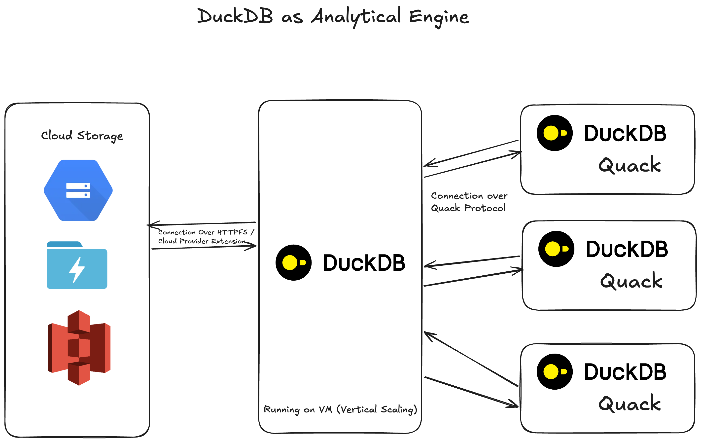

# Meteo — Analytical Lakehouse on DuckDB + Quack

## 1. Architecture Overview: DuckDB & Quack Protocol

### Model: Decoupled Client-Server Lakehouse



**DuckDB + Quack** implements a **scale-up** architecture (vertical scaling) rather than a distributed compute cluster (horizontal scaling). A single central DuckDB instance acts as the compute server while cloud object storage holds all data.

### Data Flow

1. **Storage**: Data resides in object storage (MinIO locally, S3/GCS in production) as Parquet or Iceberg files.
2. **Compute**: The DuckDB server reads data directly from object storage via the `httpfs` extension, leveraging predicate and projection pushdown to minimise I/O.
3. **Protocol**: Clients connect to the server over HTTP using the **Quack** remote protocol (`quack:hostname:9494`). Query execution happens server-side; only result sets traverse the wire.
4. **Access**: Clients use `ATTACH 'quack:host' AS db` (full catalog) or `quack_query(uri, sql)` (stateless).

### Key Benefits

| Benefit | Detail |
|---|---|
| **Pushdown compute** | All query processing runs on the server; no raw data transfers to clients |
| **Zero network overhead** | The `httpfs` extension reads from S3/MinIO directly within the server process |
| **Cost-efficient storage** | Object storage is 10–20× cheaper than block or file storage |
| **Proven analytical engine** | DuckDB's columnar vectorised engine is purpose-built for OLAP workloads |
| **Lossless serialisation** | Quack uses `application/duckdb` format, preserving complex types across the wire |

---

## 2. Local Docker Simulation

### Architecture

```
┌──────────────────────┐       ┌─────────────────────────┐
│   meteo_minio        │       │   meteo_duckdb          │
│   (minio/minio)      │◄──────┤   (python:3.11-slim)    │
│                      │httpfs │                         │
│   Ports:             │       │   Ports:                │
│     9000 (S3 API)    │       │     9494 (Quack)        │
│     9001 (Console)   │       │                         │
└──────────────────────┘       └─────────────────────────┘
```

### Usage

```bash
# Start the full stack (auto-bootstraps TPC-H at configured scale)
docker compose up --build -d

# Check bootstrap logs
docker compose logs duckdb-server --tail 10

# Connect a DuckDB client to the Quack server
# On your host machine (requires DuckDB installed):
#   ATTACH 'quack:localhost:9494' AS meteo;
#   FROM information_schema.tables;

# Scale factor auto-detection — update .env and restart:
#   TPCH_SCALE_FACTOR=10
#   docker compose down && docker compose up -d
```

### Configuration

Edit `.env` to control:

| Variable | Description | Default |
|---|---|---|
| `BOOTSTRAP_DATA` | Auto-generate TPC-H data on startup | `true` |
| `TPCH_SCALE_FACTOR` | TPC-H dataset scale factor | `0.1` |
| `QUACK_TOKEN` | Authentication token for JDBC clients | `meteo-dev-token` |
| `MINIO_ROOT_USER/PASSWORD` | MinIO admin credentials | `minioadmin` |

### Seed Script (`scripts/seed_data.py`)

Standalone TPC-H → MinIO export utility. Not required for normal use — the server auto-bootstraps data via `BOOTSTRAP_DATA=true`. Use this script if you need to generate data independently:

```bash
docker compose exec duckdb-server python -m scripts.seed_data --scale-factor 0.1
```

---

## 3. DBeaver / BI Tool Connection

Connect any JDBC-compatible tool (DBeaver, DataGrip, Tableau via JDBC) to the DuckDB Quack server using the [quack-jdbc driver](https://github.com/gizmodata/quack-jdbc) by GizmoData.

> **Credits:** [quack-jdbc](https://github.com/gizmodata/quack-jdbc) is an open-source JDBC driver created by [GizmoData](https://github.com/gizmodata) (MIT license).

### Step-by-Step Connection Setup

**1. Register the JDBC Driver**

Download `quack-jdbc.jar` from the [latest release](https://github.com/gizmodata/quack-jdbc/releases/latest). Then in DBeaver: **Database → Driver Manager → New**.


| Field | Value |
|---|---|
| Driver Name | `DuckDB (Quack)` |
| Driver Type | `Generic` |
| Class Name | `com.gizmodata.quack.jdbc.sql.QuackDriver` |
| URL Template | `jdbc:quack://{host}[:{port}]/[{database}]` |
| Default Port | `9494` |
| Driver Files | Add the downloaded `quack-jdbc.jar` under the Libraries tab |

**2. Create a New Connection**

**Database → New Database Connection → DuckDB (Quack)**. The URL template auto-fills. Set **Host** to `localhost` and **Port** to `9494`.


**3. Add Authentication Token & Test**

Under the **Driver Properties** tab, add a property with name `token` and value matching your `.env` `QUACK_TOKEN` (default: `meteo-dev-token`). Add `tls` = `false`. Click **Test Connection** to verify, then **Finish**.


### JDBC URL Format

```
jdbc:quack://host:port/database?token=YOUR_TOKEN&tls=false
```

| Property | Default | Notes |
|---|---|---|
| `host` | — | Required. Use `localhost` for local Docker. |
| `port` | `9494` | Quack server port. |
| `database` | — | Passed through to the server. |
| `token` | — | Matches the `QUACK_TOKEN` env var on the server. |
| `tls` | `false` | Enable HTTPS for production. |

---

## Project Structure

```
Meteo/
├── readme.md               # This architecture document
├── docker-compose.yml      # 3-container local stack (minio, minio-init, duckdb-server)
├── Dockerfile              # Python 3.11 slim + DuckDB
├── requirements.txt        # Python dependencies
├── .env                    # Local environment overrides (MinIO creds, bootstrap config)
├── .gitignore
├── server/
│   ├── __init__.py
│   └── main.py             # DuckDB Quack server entrypoint with TPC-H bootstrap
├── scripts/
│   ├── __init__.py
│   └── seed_data.py        # TPC-H → MinIO Parquet seeder (optional)
├── files/
│   ├── img/
│   │   ├── Architecture.png
│   │   ├── Dbeaver Quack 1.png
│   │   ├── Dbeaver Quack 2.png
│   │   └── Dbeaver Quack 3.png
│   └── jar/                # JDBC driver JARs (user-downloaded)
└── data/
    └── minio/              # MinIO bind mount (persistent, .gitignored)
```
